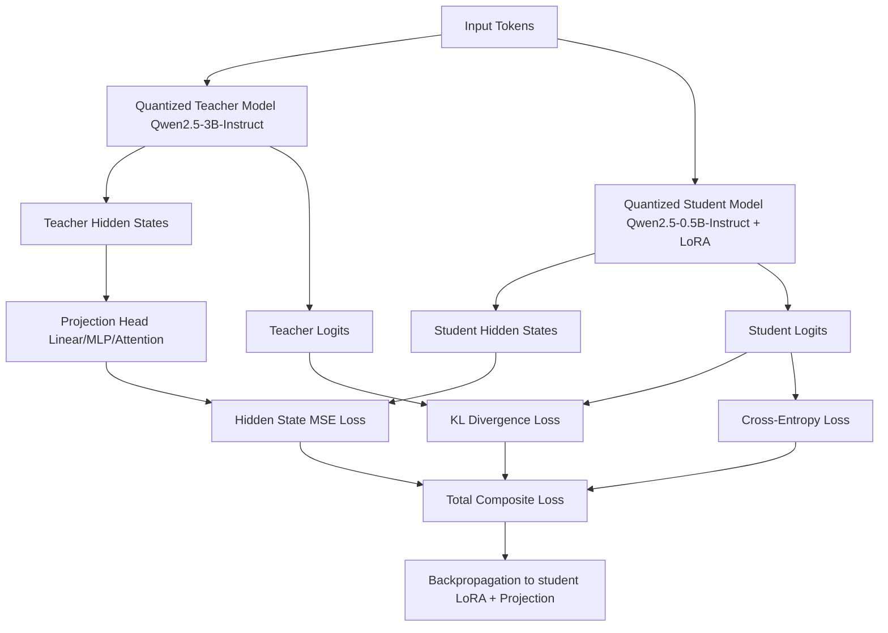

# LLM Hidden-State & Logit Distillation

This repository provides an end-to-end pipeline for **Knowledge Distillation (KD)** of Large Language Models. Specifically, it implements logit distillation (KL-Divergence) combined with projection-based hidden-state matching to distill knowledge from a larger teacher model (**Qwen2.5-3B-Instruct**) into a smaller student model (**Qwen2.5-0.5B-Instruct**) with LoRA parameter-efficient fine-tuning.

Both models are loaded in quantized 4-bit configurations (using `bitsandbytes` and `torchao`) to make distillation highly memory-efficient, allowing the complete pipeline to run comfortably on a single budget GPU (such as a Google Colab T4).

---

## 🤗 Hugging Face Artifacts

The final weights from this project's trial run are published on Hugging Face:
* **LoRA Adapter:** [sarimahsan101/Qwen2.5-0.5B-HiddenDistilled-LoRA](https://huggingface.co/sarimahsan101/Qwen2.5-0.5B-HiddenDistilled-LoRA)
* **Merged Model:** [sarimahsan101/Qwen2.5-0.5B-HiddenDistilled](https://huggingface.co/sarimahsan101/Qwen2.5-0.5B-HiddenDistilled)

---

## 📌 Distillation Architecture

### Loss Components:
* **Supervised Fine-Tuning Loss ($L_{CE}$)**: Standard Cross-Entropy loss computed on the target response tokens, ensuring the student maintains base instruction-following capabilities.
* **Logit Distillation Loss ($L_{KD}$)**: Kullback-Leibler (KL) divergence between the student's and teacher's token prediction probability distributions, scaled by temperature $T$ to soften the target probabilities.
* **Hidden-State Distillation Loss ($L_{hidden}$)**: Mean Squared Error (MSE) between the student's hidden states and the projected teacher's hidden states (using a learnable projection head mapping the teacher's $3072$-dimension down to the student's $896$-dimension).

---

### Mathematical Formulations

#### 1. Composite Objective Function
$$L_{\text{total}} = w_{ce} L_{CE} + w_{kd} L_{KD} + w_{hidden} L_{hidden}$$

#### 2. Logit Kullback-Leibler Loss
$$L_{KD} = T^2 \cdot D_{KL} \left( \text{Softmax}\left(\frac{\text{Logits}_{\text{Teacher}}}{T}\right) \parallel \text{Softmax}\left(\frac{\text{Logits}_{\text{Student}}}{T}\right) \right)$$

#### 3. Projected Hidden-State Loss (Normalized MSE)
$$L_{hidden} = \frac{1}{N} \sum_{i=1}^{N} \left\| \bar{H}_{\text{student}} - \bar{H}_{\text{projected teacher}} \right\|^2$$

### Data Flow Diagram



---

## 📂 Repository Structure

```
.
├── src/
│   ├── __init__.py
│   ├── config.py       # Dataclass defining distillation and training args
│   ├── models.py       # Model loading, quantization config, LoRA setup, and projection heads
│   ├── dataset.py      # Multi-source dataset formatting and streaming (Alpaca, Dolly, Ultrachat)
│   ├── evaluator.py    # Metric evaluations (perplexity, KL divergence, hidden similarity, TruthfulQA)
│   ├── trainer.py      # Custom distillation loss trainer & training budget callbacks
│   └── utils.py        # GPU memory monitoring and training curve plotting
├── notebooks/
│   └── distillation_hiddenstates_optimized.ipynb  # Original development notebook
├── train.py            # Main entrypoint script for CLI execution
├── requirements.txt    # Python dependencies
└── .gitignore          # Git exclusion filters
```

---

## 🛠️ Setup and Installation

1. **Clone the repository**:
   ```bash
   git clone https://github.com/your-username/distillation-hiddenstates.git
   cd distillation-hiddenstates
   ```

2. **Install dependencies**:
   ```bash
   pip install -r requirements.txt
   pip install --upgrade torchao
   ```

---

## 🚀 How to Run

### Training and Evaluation
To start the end-to-end distillation process (running baseline evaluation, training, final evaluation, merging adapters, and saving results):
```bash
python train.py
```

### Advanced CLI Customizations
The script accepts several command-line overrides:
- Change models and output path:
  ```bash
  python train.py --teacher_model "Qwen/Qwen2.5-7B-Instruct" --student_model "Qwen/Qwen2.5-1.5B-Instruct" --output_dir "./custom_output"
  ```
- Change training configuration:
  ```bash
  python train.py --num_epochs 3 --learning_rate 3e-5 --time_budget 240
  ```
- Override batch size and gradient accumulation (auto-detects by default based on GPU VRAM):
  ```bash
  python train.py --batch_size 4 --grad_accum 4
  ```
- Authenticate and push the final LoRA adapter and merged model directly to the Hugging Face Hub:
  ```bash
  python train.py --push_to_hub --hf_token "your_hf_token" --repo_id_lora "username/Qwen2.5-0.5B-LoRA-Adapter" --repo_id_merged "username/Qwen2.5-0.5B-Distilled"
  ```

---

## 📊 Trial Run Results (Google Colab T4)

Below are the evaluation metrics recorded from an initial short trial run using a single **NVIDIA Tesla T4 (16GB)** GPU, training with a small representative dataset sample for **1 epoch** under a tight time budget.

| Metric | Before Training (Baseline) | After Training (1 Epoch) | Change | Status |
| :--- | :---: | :---: | :---: | :---: |
| **Validation Perplexity** | 5.0924 | 5.2620 | +0.1696 | ✗ |
| **Teacher-Student KL Divergence** | 2.7913 | 1.9637 | -0.8276 | ✓ |
| **Hidden State Cosine Similarity** | 0.0075 | 0.0054 | -0.0021 | ✗ |

### 💡 Results Analysis & VRAM Constraints
Due to hardware limitations (T4 GPU memory cap) and restricted wall-clock time, this trial run used a trimmed dataset size (totaling 2,500 sequences across Alpaca, Dolly, and Ultrachat) and was stopped after a single epoch. 
* **Teacher-Student KL Divergence** showed a **significant improvement (declined by 0.8276)**, indicating that the student's output probability distributions are aligning closer to the teacher's logits.
* **Perplexity and Hidden-State Cosine Similarity** did not show improvement. Hidden state alignments take longer to converge than logits, and a projection head initialized from scratch requires more optimization steps (epochs) on larger training corpora.
* **Scaling Up**: To achieve positive results across all metrics, run training on a larger GPU (e.g., A100 or L4) with `--num_epochs 3` or higher and increase `dataset_sizes` in `src/config.py` to process the full datasets.

---

## 📝 License
This project is licensed under the Apache 2.0 License.
